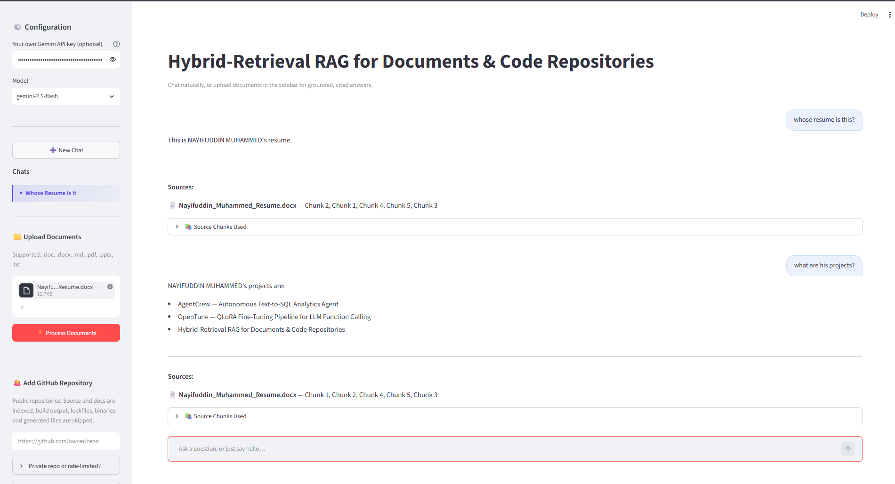
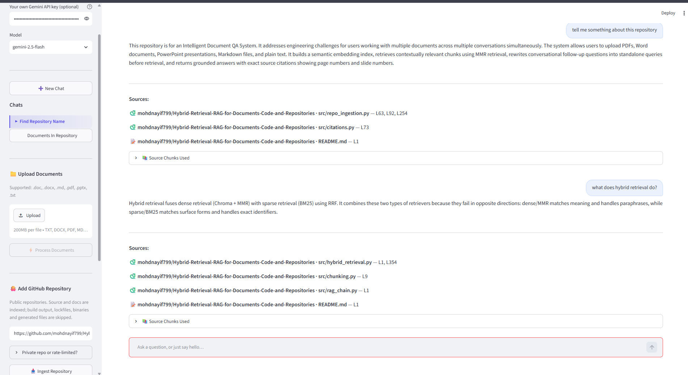
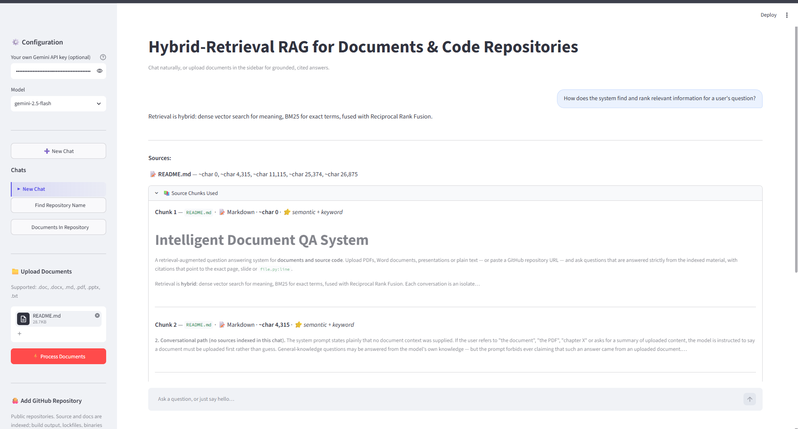
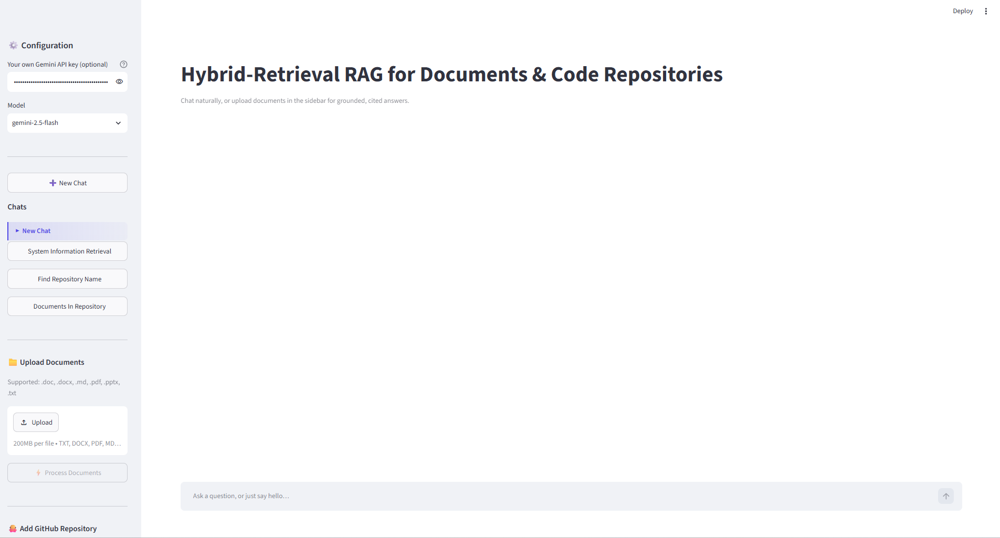
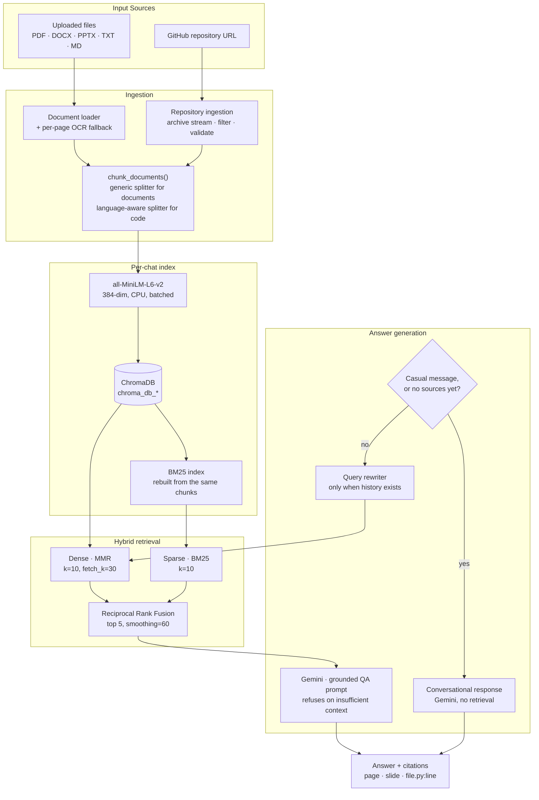
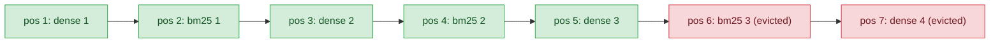

# Hybrid-Retrieval RAG for Documents & Code Repositories

A retrieval-augmented question answering system for **documents and source code**. Upload PDFs, Word documents, presentations or plain text — or paste a GitHub repository URL — and ask questions that are answered strictly from the indexed material, with citations that point to the exact page, slide, character offset, or `file.py:line`.

Retrieval is **hybrid**: dense vector search for meaning, BM25 for exact terms, fused with Reciprocal Rank Fusion. A controlled retrieval evaluation — 93 hand-authored queries over a 1,222-chunk corpus, scored with confidence intervals and significance tests — measures exactly where that combination helps, where it doesn't, and why (see [Evaluation](#evaluation)). Each conversation is an isolated workspace with its own vector store, and documents and repositories can be indexed side by side in the same chat.

---

## Table of Contents

- [Demo](#demo)
- [What the system does](#what-the-system-does)
- [Grounding behaviour](#grounding-behaviour)
- [Retrieval architecture](#retrieval-architecture)
- [GitHub repository ingestion](#github-repository-ingestion)
- [Code-aware chunking and citations](#code-aware-chunking-and-citations)
- [Architecture](#architecture)
- [Testing](#testing)
- [Engineering problems solved](#engineering-problems-solved)
- [Project structure](#project-structure)
- [Installation](#installation)
- [Usage](#usage)
- [Evaluation](#evaluation)
- [Known limitations](#known-limitations)
- [Technology stack](#technology-stack)
- [Roadmap](#roadmap)

---

## Demo

### Document QA



Uploading a `.docx` file and asking natural-language questions about it. Each answer lists its source chunks, and the chat's title is generated automatically from the first question.

### GitHub Repository Ingestion



A public GitHub repository (this project's own) ingested from the sidebar and queried in the same chat. Answers cite exact files and line numbers — `src/repo_ingestion.py — L63, L92, L254`.

### Hybrid Retrieval / Source Citations



The *Source Chunks Used* panel, expanded to show retrieved chunks alongside their provenance badge — `⭐ semantic + keyword` marks a chunk both retrievers agreed on.

### Multi-Chat Isolation



Independent, LLM-titled chats in the sidebar. Each keeps its own sources, history and vector store.

---

## What the system does

| Capability | Description |
|---|---|
| **Document ingestion** | PDF, DOCX, DOC, PPTX, TXT, MD — one Document per page, slide or file |
| **OCR fallback** | Scanned PDF pages are detected per page and routed through EasyOCR; typed pages use fast text extraction |
| **GitHub ingestion** | Paste a public repository URL; source and documentation files are indexed alongside uploaded documents |
| **Hybrid retrieval** | Dense MMR vector search fused with BM25 lexical search via Reciprocal Rank Fusion |
| **Grounded answers** | Answers are constrained to retrieved context, with an explicit refusal when evidence is insufficient |
| **Exact citations** | Page numbers for PDF, slide numbers for PPTX, character offsets for TXT/MD, `path/file.py:line` for repository code |
| **Retrieval provenance** | Every returned chunk records whether it was found by semantic search, keyword search, or both |
| **Multi-chat workspace** | Independent conversations, each with their own sources, history and vector store |
| **Incremental indexing** | Adding a second source appends to the existing store rather than rebuilding it |
| **Conversational memory** | Follow-ups such as "what about the next one?" are rewritten into standalone queries before retrieval |
| **Session response cache** | Repeated questions are served from an in-memory cache without an LLM call |
| **LLM-generated titles** | The first question in a chat produces a concise title |

---

## Grounding behaviour

Grounding is enforced by prompt construction and by routing, not by a post-hoc filter. Two code paths exist, and which one runs is decided before any retrieval happens; the conversational path then distinguishes two situations by which context it injects into the prompt.

**1. Retrieval path (documents or a repository are indexed, and the message is a real question).**
The answer prompt instructs the model to use only the supplied context and, when the context does not contain the answer, to reply with a fixed refusal string:

> `I don't have enough information in the provided documents to answer this.`

This is a prompt-level instruction, not a deterministic code check — retrieval always runs and the model is always called on this path, regardless of how many chunks come back; the model is relied on to recognise insufficient context and emit that exact sentence. Conversation history is passed alongside the retrieved context, explicitly labelled as usable for resolving references such as "them" or "next" but **not** as a source of facts. This matters: without the separation, the model would answer follow-ups from what it said earlier rather than from what was retrieved.

**2. Conversational path (no sources indexed in this chat).**
The system prompt states plainly that no document context was supplied. If the user refers to "the document", "the PDF", "chapter X" or asks for a summary of uploaded content, the model is instructed to say a document must be uploaded first rather than guess. General-knowledge questions may be answered from the model's own knowledge — but the prompt forbids ever claiming that such an answer came from an uploaded document.

**3. Conversational path (sources exist, but the message is small talk).**
A deterministic, zero-API-cost classifier recognises greetings, thanks, acknowledgements and identity questions. It uses `re.fullmatch` against the entire normalised message rather than a substring search, so a compound message like *"Thanks, and what does chapter 3 say?"* fails every pattern and correctly reaches the retriever. A false positive — a real question misrouted as small talk — is the expensive error, which is why the matching is deliberately conservative. A false negative merely wastes a retrieval; the answer prompt contains a secondary instruction that handles small talk gracefully if it reaches that far.

Situations 2 and 3 are served by one shared conversational-response function, parameterised by whether sources exist, rather than by separate code branches — the routing decision itself is a single two-way check (`no sources OR small talk` → conversational, else → retrieval), not a three-way dispatch.

**What this does not do.** There is no separate verification model checking the answer against the context after generation. Grounding rests on prompt constraints and on retrieval quality. A refusal is evidence that retrieval found nothing usable; it is not proof that the material is absent from the corpus.

---

## Retrieval architecture

Retrieval combines two methods that fail in opposite directions.

### Dense — Chroma + MMR

`all-MiniLM-L6-v2` embeddings (384-dimensional, normalised, CPU) in ChromaDB, retrieved with Maximal Marginal Relevance at `k=10`, `fetch_k=30`, `lambda_mult=0.6`.

Dense search matches **meaning**. It handles paraphrase well — *"how do I cancel"* finds *"termination of the agreement"*. MMR is used instead of plain cosine similarity because with several documents indexed, top-k nearest neighbours cluster on whichever single source scores highest; MMR fetches a larger candidate pool and selects results that are jointly relevant and mutually diverse.

### Sparse — BM25

Okapi BM25 (`rank_bm25`) over exactly the same chunks, read back out of the Chroma collection so there is one ingestion path and one chunking policy behind both indexes.

Sparse search matches **surface form**. It finds `CVE-2024-3094`, `Section 4.2`, `validate_access_token` — rare tokens that a 384-dimensional projection tends to smear. It is blind to synonyms and returns nothing when the query and the document use different vocabulary.

Two implementation details worth naming:

- **Candidacy is decided by query-term overlap, not by a positive score.** Okapi's IDF goes negative for terms appearing in more than roughly half the corpus, and a chat holding one short upload is exactly that regime. Filtering on `score > 0` silently discarded genuine matches on small corpora.
- **The tokenizer splits identifier case boundaries before lowercasing.** Without this, `_` acts as a word boundary by accident while camelCase and PascalCase collapse into a single token, so `build_hybrid_retriever` was reachable from the query *"build hybrid retriever"* but `buildHybridRetriever` was not. Both corpus and query are tokenized identically, so an exact paste of an identifier still matches.

### Fusion — Reciprocal Rank Fusion

The two ranked lists are merged with weighted RRF (`smoothing=60`, equal weights) and the top 5 chunks go into the prompt:

```
score(chunk) = Σ  weight / (60 + rank_in_that_list)
```

RRF is used rather than score blending because Chroma returns cosine distances and BM25 returns unbounded corpus-relative scores; the two have no common scale, and per-query normalisation is unstable when one list is short or nearly uniform. RRF uses only ranks. A chunk found by both retrievers accumulates two terms and therefore outranks a chunk found by one. Sorting is stable and BM25's own internal ties break on ascending corpus index, so a fixed candidate set always fuses to the same order.

**One exception to plain RRF order.** If a repository's top-level README has any lexical (BM25) relevance to the query and is not already among the fused top 5, it replaces the weakest of the five slots. The reasoning is that a repository's own README is disproportionately likely to be useful context for a question about that repository, even when it doesn't rank there on fusion score alone — it is the only way a chunk enters the final answer without earning its position through RRF.

### What hybrid retrieval does and does not guarantee

Hybrid retrieval is **not** a universal improvement. It is a targeted fix for one failure mode: queries whose discriminative content is an exact token that embeddings blur. On paraphrase-heavy queries BM25 contributes nothing — it returns no lexical overlap and fusion degrades cleanly to the dense ranking.

A controlled retrieval evaluation (93 queries, 1,222 chunks — see [Evaluation](#evaluation)) measures this directly rather than leaving it as a design argument: hybrid and dense-only are statistically indistinguishable on this project's code corpus, hybrid shows a suggestive but not statistically significant edge on the document corpus, and the evaluation diagnoses a specific, arithmetic mechanism — equal-weight RRF's strict interleaving — by which fusion can evict a dense top-5 candidate that dense-only alone would have returned.

Every returned chunk carries a `retrieval` field recording which retriever surfaced it, rendered in the UI as **🧠 semantic**, **🔍 keyword** or **⭐ semantic + keyword**, so the contribution is inspectable per query rather than assumed. If `rank_bm25` is unavailable or the index fails to build, retrieval falls back to dense-only with a warning instead of failing.

---

## GitHub repository ingestion

A public repository can be indexed as a source alongside uploaded documents.

```
GitHub URL
   │  strict parsing — github.com only, owner/repo validated against a narrow charset
   ▼
Resolve ref + size          1 API call: default branch, and repo size checked BEFORE download
   ▼
Download tarball            1 request to the archive endpoint, streamed with a size cap
   ▼
Stream + filter             tarfile read in memory; never extracted to disk
   ▼
Code-aware chunking         RecursiveCharacterTextSplitter, per-language separators
   ▼
Chroma + BM25               same store, same retriever as uploaded documents
   ▼
Grounded answer + src/file.py:142 citations
```

### Why an archive rather than the Contents API

One request downloads the whole repository. Walking the Contents API file by file would exhaust the 60 requests/hour unauthenticated limit on a single medium repository. An optional personal access token raises that ceiling and is used only for the request — it is never stored.

### Safety constraints that actually exist in the implementation

| Constraint | Value | Purpose |
|---|---|---|
| Host allowlist | `github.com` only | Owner and repo are validated against a narrow charset before being interpolated into an `api.github.com` URL, so a crafted URL cannot redirect the request elsewhere |
| No disk extraction | — | Members are streamed and read into memory. Nothing attacker-controlled is used as a write path, so path traversal and symlink escapes are structurally impossible rather than mitigated |
| Regular files only | — | Symlinks, hardlinks, devices and directories are skipped before any read |
| Path validation | — | Absolute paths and `..` segments are rejected even though nothing is written, because the path becomes a citation shown to the user |
| Repository size | 200 MB | Checked from the API response before any bytes are transferred |
| Archive download | ~157 MB | Streamed with a running cap |
| Archive expansion | 2 GB | Guard summed from tar headers before any member is read — an absolute ceiling, not a compression-ratio check |
| Per file | 512 KB | Larger files are skipped, not fatal |
| Indexable files | 3,000 | **Hard refusal.** A silently truncated index answers "I don't have enough information" for content the user believes is indexed |
| Retained text | ~41 MB | Bounds what is kept |

### Filtering

Four layers, cheapest first: a directory blocklist (`.git`, `node_modules`, `venv`, `dist`, `build`, `__pycache__`, `.idea`, `.terraform`, and others), a filename blocklist (lockfiles, `.DS_Store`), a suffix blocklist (binaries, images, archives, `.min.js`, sourcemaps), and an **extension allowlist** of 50 source and documentation types (30 mapped to a specific language for chunking, 20 more indexed with a generic splitter). Files that survive are then UTF-8 decoded — catching binaries with text extensions — and screened for a maximum line length, which catches minified or generated output that carries no `.min` marker.

The UI reports what was filtered and why, so an unexpectedly small index is visible rather than silent.

### Coexistence with documents

Repository chunks land in the same per-chat Chroma store as uploaded documents, and both indexes are built over the combined corpus. A single chat can hold a PDF and a repository, and one answer can cite both. Sources are labelled by type so the two never blur together.

---

## Code-aware chunking and citations

**Chunking.** Repository source files are split with `RecursiveCharacterTextSplitter`, using separators fetched per language through `get_separators_for_language()` — splitting Python at `\nclass ` and `\ndef `, JavaScript at function boundaries, Markdown at headings. 30 file extensions map to 22 languages; anything unmapped falls back to the generic splitter. Because the supported language set varies across `langchain-text-splitters` releases, separator availability is checked at runtime rather than assumed.

Code uses `chunk_size=800`, `chunk_overlap=100` against the document defaults of `1000/200`. These are **heuristics, not measured optima** — code is denser than prose and language separators already cut at semantic boundaries, so less overlap is needed.

Language-aware splitting is applied **only** to chunks whose `source_type` is `repo`, never on file extension alone. `.md` and `.txt` exist in both worlds: an uploaded README must keep the chunking it already had, while a repository README should be split on headings. Extension cannot distinguish those cases; source type can.

**Citations.** Repository chunks carry the repository-relative path, the repo slug, the ref, and a starting line number computed after splitting from the chunk's character offset within its file:

```
🐍 owner/repo · src/rag_chain.py — L88, L142
📕 handbook.pdf — Page 3, Page 7
```

The source-chunk panel shows the fully qualified reference `src/rag_chain.py:142` alongside the retriever that found it.

**Nested files with the same basename stay distinct.** Citations group on `(source type, repo, full relative path)` rather than the filename, so every `__init__.py` in a package tree is cited separately instead of collapsing into one ambiguous entry. Uploaded files group by basename alone, since two different uploads sharing a filename is prevented separately, at upload time, by per-chat name deduplication. Display names are also escaped before rendering, because a path like `pkg/__init__.py` would otherwise be interpreted as Markdown emphasis and displayed as a path that does not exist.

---

## Architecture



**Call budget per question.** A casual message, or a question in a chat with no sources yet, costs one Gemini call. A first RAG question in a chat costs one call (retrieval plus generation; the rewriter is skipped when there is no history); a follow-up costs two — one to rewrite the query, one to answer. Retrieval itself costs nothing. Independently of routing, the very first message in a new chat triggers one additional call to generate a short chat title.

---

## Testing

The suite runs without a Streamlit runtime, without ChromaDB, without the embedding model and without an API key. The ranking, ingestion, chunking and citation logic is deliberately kept in modules that import none of those, so the tests are fast and cost no API quota.

```bash
python -m pytest tests/ -q
# 240 passed, 58 subtests
```

| Test file | Test functions | Covers |
|---|---|---|
| `test_hybrid_retrieval.py` | 48 | Tokenization including camelCase and PascalCase, BM25 scoring and candidacy, RRF fusion and dedup, retriever fallback and determinism |
| `test_repo_ingestion.py` | 22 | URL parsing and rejection, path traversal, symlink entries, archive filtering, size/count/bomb limits, repository metadata |
| `test_citations.py` | 25 | Location formatting per source type, path-vs-basename grouping, Markdown-safe rendering, location ordering |
| `test_chunking.py` | 13 | Language dispatch, line-number accuracy, and a regression test asserting document chunking is byte-identical to the pre-change implementation |
| `test_repo_pipeline.py` | 11 | End-to-end archive → documents → chunks → hybrid retrieval → citations, plus Chroma metadata-type compatibility |
| `test_store_paths.py` | 8 | Store-directory namespacing and cleanup isolation |
| `test_casual_detection.py` | 11 (+58 subtests) | Casual-message classification and, critically, that compound messages are not misrouted |
| `test_benchmark_metrics.py` | 35 | `benchmark.metrics` — Hit@K, MRR@K, Recall@K — against synthetic fixtures |
| `test_benchmark_specs.py` | 26 | Benchmark ground-truth and specification handling introduced for the range-level document scoring in evaluation v2 |
| `test_benchmark_sweep.py` | 16 | Configuration-sweep harness wiring for the tested-but-not-shipped configurations in [Evaluation](#evaluation) |

Test-function counts above were counted directly from the current source (`def test_*`, including class-based methods). Running the full suite reports more passes than that sum — `test_repo_ingestion.py` and three of the benchmark files use `@pytest.mark.parametrize` to run one function over several cases, and `test_casual_detection.py`'s `subTest` blocks report separately — which is why `pytest -q` totals 240 passed with 58 subtests rather than 215.

None of the benchmark tests assert on a measured, corpus-dependent number: they exercise the scoring and configuration code against fixed synthetic fixtures, since the actual benchmark numbers in [Evaluation](#evaluation) are measurements, not invariants, and move if the corpus does.

### Repository retrieval smoke test

```bash
python smoke_repo_retrieval.py
```

This packs the project's own source tree into a GitHub-shaped tarball and pushes it through the real ingestion path — archive reading, filtering, language chunking, line numbering, BM25 indexing, RRF fusion and citation rendering are all real. It verifies:

- **Filtering** — `.git`, `__pycache__` and unsupported types are excluded; all surviving paths are relative; ingestion order is deterministic
- **Chunking** — chunks are produced, every chunk carries a start line, chunk keys are unique, and all metadata values are Chroma-compatible scalars
- **Line-number accuracy** — every reported line number is checked by reading that line back out of the source file it claims to come from
- **BM25 retrieval** — natural-language queries reach the functions they name
- **RRF fusion** — a chunk the dense retriever did not return is recovered by the lexical side
- **Provenance** — every result carries its retriever origin and fusion score
- **Citations** — every reference renders as `path:line`

The dense retriever is stubbed (it needs `torch` and ChromaDB, which this script deliberately avoids), so it exercises everything except the embedding model itself. It makes **no Gemini API calls** — retrieval runs entirely before generation.

---

## Engineering problems solved

| Problem | Root cause | Resolution |
|---|---|---|
| Documents disappearing after a second upload | Two concurrent SQLite clients on one ChromaDB file cause write conflicts on Windows | Clear the cached connection and run `gc.collect()` before opening the append client; the create path now uses the cached client so only one is ever open |
| Running the evaluation script deleted live chats | Cleanup globbed `chroma_db*` and removed every store except the one it had just created, including stores belonging to open Streamlit chats | Evaluation stores use a separate `chroma_eval_` namespace, so the destructive glob cannot name chat data. Structural, not a guard clause |
| All retrieved chunks came from one document | Cosine top-k clusters on whichever source scores highest | MMR over a larger candidate pool |
| Exact identifiers were unreachable in JS/Java/Go code | The tokenizer lowercased before splitting, so `_` was a word boundary by accident and camelCase collapsed into one token — BM25 returned nothing, and hybrid silently degraded to dense-only on exactly the queries where dense is weakest | Split identifier case boundaries before lowercasing, applied identically to corpus and query |
| BM25 returned nothing on small corpora | Okapi IDF goes negative for terms in more than half the corpus, and the hit filter used `score > 0` | Candidacy decided by query-term overlap, which is corpus-size independent |
| `pkg/__init__.py` displayed as `pkg/init.py` | Markdown reads `__init__` at a word boundary as strong emphasis. The test asserted on the Markdown source, which did contain the path, so it passed while the rendered output was wrong | Escape display names, and assert on rendered output in the test |
| Citations merged unrelated files | Grouping used `os.path.basename`, so every `__init__.py` in a repository became one entry | Group on the full relative path plus source type |
| Sources vanished from earlier answers | Sources were rendered only in the live response path and never stored on the message | Sources are persisted with each assistant message and drawn by a single renderer shared with the history replay |
| `"tell me about them"` returned nothing | The retriever received the raw follow-up with no idea what "them" meant | Query rewriting pass before retrieval, with a guard that falls back to the original question if the rewrite looks like a model preamble rather than a query |
| Scanned PDFs produced empty chunks | `PyPDFLoader` cannot extract text from image-only pages | Per-page OCR fallback below a character threshold, rendered via PyMuPDF and read by EasyOCR across a small thread pool |
| A configuration sweep showed a rank "improve" from `k=6`, which should be impossible — truncation can only drop candidates, never reorder them | Merely opening and querying a Chroma store rewrites `chroma.sqlite3` on disk, so the dense candidate list for some queries can differ across separate process launches against the very same store directory | Recompute the baseline configuration in the same process as the configurations being compared, so every arm sees one identical candidate list; cross-checked against the previously published baseline with 0 mismatches out of 39 queries |
| Ctrl+C opened the clear-cache dialog | A Streamlit hotkey fires on the `keyup` for `C`; releasing the modifier first made it look like a bare keypress | Fixed upstream in Streamlit 1.63.0, which is now the minimum version |

---

## Project structure

```
Hybrid-Retrieval-RAG-for-Documents-Code-and-Repositories/
│
├── app.py                       # Streamlit UI, chat state, ingestion controls
├── demo_key.py                  # Shared/rate-limited API key for a public demo deployment
├── evaluate_retrieval.py        # Retrieval-only evaluation harness (dense / BM25 / hybrid)
├── evaluate_citations.py        # Citation verification against real source files
├── smoke_repo_retrieval.py      # Retrieval-only smoke test against a real source tree
├── requirements.txt
├── pytest.ini
│
├── src/
│   ├── data_ingestion.py        # Format router, per-page OCR fallback
│   ├── repo_ingestion.py        # GitHub URL parsing, archive streaming, filtering
│   ├── chunking.py              # Single chunking entry point, language dispatch, line numbers
│   ├── code_languages.py        # Extension -> Language map, indexable extensions
│   ├── vector_store.py          # Chroma create/append/load, batched embedding, store stats
│   ├── store_paths.py           # Store directory naming and cleanup rules
│   ├── hybrid_retrieval.py      # BM25 index, RRF fusion, HybridRetriever
│   ├── citations.py             # Citation formatting and grouping
│   └── rag_chain.py             # Routing, query rewriting, grounded generation
│
├── benchmark/                    # Controlled retrieval evaluation (see Evaluation)
│   ├── RESULTS_V2.md             # Final results: 93 queries, 1,222 chunks
│   ├── TUNING.md                 # Pre-registered configuration sweep
│   ├── blind_audit_log.md        # Ground-truth quality audit, logged before outcomes were known
│   └── corpus_manifest.json      # Pinned corpus: repo commit SHA, document hashes, chunk counts
│
├── tests/                        # 240 passed, 58 subtests — no API key or ML stack required
│
└── chroma_db_*/                  # Per-chat vector stores (auto-created, gitignored)
    chroma_eval_*/                # Evaluation stores (separate namespace)
```

Modules are separated so the ranking, ingestion and citation logic can be tested without Streamlit, Chroma or the embedding model. `repo_ingestion` never imports `data_ingestion`; both feed a single chunking entry point, so the vector index and the BM25 index are always built from identically chunked material.

---

## Installation

### Prerequisites

- Python 3.10 or later (verified on 3.10.11)
- A free [Google AI Studio](https://aistudio.google.com) API key

### Setup

```bash
git clone https://github.com/mohdnayif799/Hybrid-Retrieval-RAG-for-Documents-Code-and-Repositories.git
cd Hybrid-Retrieval-RAG-for-Documents-Code-and-Repositories

python -m venv venv
# Windows
venv\Scripts\activate
# macOS / Linux
source venv/bin/activate

pip install -r requirements.txt
```

The first run downloads the `all-MiniLM-L6-v2` embedding model (~90 MB) and EasyOCR weights. Later runs use the local cache.

### Environment

Create a `.env` file in the project root:

```env
GOOGLE_API_KEY=your_key_here
```

The key can also be entered directly in the sidebar at runtime, which takes priority over the environment variable and is never written to disk.

### Run

```bash
streamlit run app.py
```

The application opens at `http://localhost:8501`.

---

## Usage

1. Enter your Gemini API key in the sidebar.
2. **Documents** — upload one or more files and click *Process Documents*.
3. **Repository** — paste a public GitHub URL and click *Ingest Repository*. Progress runs through resolve, download, read, chunk and embed; a summary reports how many files were kept and why the rest were filtered.
4. Ask questions. Follow-ups referring to earlier answers are resolved before retrieval.
5. Inspect the Sources block under any answer, or expand *Source Chunks Used* to see the retrieved text and which retriever found it. Every answer keeps its own sources for the life of the conversation.
6. Switch chats from the sidebar; each restores its own sources and history.

Documents and repositories can be combined in one chat.

---

## Evaluation

The retrieval architecture above states what dense search and BM25 are each good at; this section measures it, on a real corpus, with a labelled query set and standard statistical tests — rather than leaving it as a design argument.

The evaluation ran in two rounds. Expanding the corpus and query set between them reversed two conclusions from the first round: a "ceiling effect" on the document bucket turned out to be substantially a ground-truth artifact, and a candidate fix for [the mechanism described below](#the-diagnosed-mechanism-equal-weight-rrf-interleaving) (`final_k=8`) turned out to match dense-only exactly, once the comparison controlled for context budget. Everything below reports the final round only, so the numbers here — not any earlier draft — are the ones to trust.

No shipped file was touched by any of this (SHA-256 prefixes of `hybrid_retrieval.py`, `app.py`, `vector_store.py`, `citations.py` and `chunking.py` were verified unchanged), and no Gemini API call was made anywhere in the retrieval evaluation — it is entirely retrieval-side and scored against known chunk locations, not generated answers.

### Corpus and queries

| | |
|---|---|
| Repository | `psf/requests`, pinned at a fixed commit — 1,111 chunks |
| Documents | one PDF (4 chunks), one text file (8 chunks), one substantial `.docx` (99 chunks) |
| **Total chunks** | **1,222** |
| Queries | 93, hand-authored, across 3 buckets and 8 categories |

The 93 queries split into **Bucket 1 — code (n=44)**: `exact_identifier`, `paraphrase`, `conceptual`, `literal_string`, `cross_file`; **Bucket 2 — documents (n=39)**: `doc_factual`, `doc_conceptual`, `doc_paraphrase`, `doc_exact_term`, `doc_discrimination`; and **Bucket 3 — unanswerable (n=10)**, off-domain or adjacent-but-absent questions verified to have zero occurrences in the corpus.

Ground truth was authored question-first and verified against the real, freshly built corpus, then bias-audited by measuring lexical token overlap between each query and its answer (a query that reuses the answer's own words is an easier test than the category label suggests). A blind quality audit — logged **before** any result from the expanded query set was known — reviewed every new query against five criteria (ground-truth error, ambiguity, unrealistic phrasing, duplication, mislabelling) and recorded its judgments with timestamps before the corresponding evaluation ran. One duplicate query was removed on that basis before any arm was run; two mislabelled queries were rewritten. The 56 queries carried over from the first round were **not** re-audited and none were removed, edited or reweighted — the person conducting the audit had already seen their outcomes in the earlier round and states this explicitly rather than claiming blindness it didn't have.

**A ground-truth asymmetry that governs how to read every result below.** Bucket 1's ground truth is file-level — a "hit" is any chunk of the correct file, and the measured breadth of that ground truth is 51–187 chunks depending on category. Bucket 2's ground truth is `start_index`-range-level — 1–5 specific chunks per query. Bucket 2's ground truth is roughly **30× more precise**, so Bucket 1 and Bucket 2 Hit@5 must never be compared to each other; a lower Bucket 2 number does not mean document retrieval is worse.

### Statistical method

Hit@1/3/5, MRR@5 and Recall@5 with 95% Wilson confidence intervals; McNemar's exact test on discordant Hit@5 pairs for the primary significance claim, plus a supplementary exact two-sided sign test on every non-tied rank change (more observations, finer-grained); a determinism check that rebuilds the vector store from scratch and diffs every ranked list across two independent builds.

**Determinism.** BM25 is exactly reproducible across builds. Dense (and therefore hybrid) differ on a small number of queries across independent builds, traced to one specific query that is genuinely bistable — across five separate process launches on one store it returns dense rank 1 on two launches and rank 2 on the other three, moving Bucket 1 Hit@1 by one query (53.8% ↔ 56.4%). It was kept rather than removed: measurement instability isn't one of the five audit criteria, and dropping it would conveniently move a headline number. Bucket 1's Hit@1 and MRR@5 should be read with a ±1-query reproducibility band.

### Bucket 1 — code corpus (n = 44)

| Metric | dense-only | BM25-only | hybrid |
|---|---|---|---|
| Hit@1 | **56.8%** [42.2, 70.3] | 36.4% [23.8, 51.1] | 52.3% [37.9, 66.2] |
| Hit@3 | 79.5% [65.5, 88.8] | 63.6% [48.9, 76.2] | **84.1%** [70.6, 92.1] |
| Hit@5 | **88.6%** [76.0, 95.0] | 75.0% [60.6, 85.4] | 86.4% [73.3, 93.6] |
| MRR@5 | **0.692** | 0.505 | 0.664 |

McNemar on Hit@5 flips: 3 discordant pairs, **p = 1.0000**. Supplementary sign test on all rank changes: 22 non-tied observations, **p = 0.5235**. Both agree with `scipy.stats.binomtest` to 1e-12. **This evaluation cannot distinguish dense-only from hybrid on the code corpus** — 3 discordant pairs is below the 6 needed for significance at any plausible split.

Provenance of hybrid's 38 Bucket 1 hits: 71% found by both retrievers, 18% by vector alone, 11% by BM25 alone — including on `literal_string` queries, the category BM25 was expected to own outright but where every hit was already found by the dense side too.

### Bucket 2 — documents (n = 39)

| Metric | dense-only | BM25-only | hybrid |
|---|---|---|---|
| Hit@1 | 66.7% [51.0, 79.4] | 66.7% [51.0, 79.4] | **69.2%** [53.6, 81.4] |
| Hit@3 | 74.4% [58.9, 85.4] | 84.6% [70.3, 92.8] | **84.6%** [70.3, 92.8] |
| Hit@5 | 76.9% [61.7, 87.4] | **87.2%** [73.3, 94.4] | **87.2%** [73.3, 94.4] |
| MRR@5 | 0.706 | 0.740 | **0.762** |

McNemar: 0 wins for dense, 4 wins for hybrid, 4 discordant pairs, **p = 0.125**. Every discordant pair favours hybrid — the first sign in this project of hybrid actually helping — but 4 is still short of the 6 needed for significance, so this is **suggestive, not established**.

The first round had labelled this bucket a ceiling and excluded it from the comparison. Scoring the same retrievals both ways shows why that was partly a measurement artifact: file-level ground truth reports 97–100% Hit@5 on retrievals that range-level ground truth (used above) scores at 77–87%. Two findings emerged that ran against the original hypotheses: `doc_discrimination` — near-duplicate section clusters expected to confuse retrieval — scored 100% on all three methods, and `doc_paraphrase` — expected to be routine — scored **20% on all three methods**, with every arm returning chunks from the right document but the wrong section. That is a genuine vocabulary-mismatch failure, not a ground-truth defect, and the evaluation's own conclusion is that this is where retrieval work would actually pay off (see [Roadmap](#roadmap)).

### Bucket 3 — unanswerable (n = 10)

Dense-only refuses the retrieval precondition 0% of the time, BM25-only and hybrid 10%. All three methods return 5 chunks for essentially every unanswerable question — **nothing in the retrieval layer abstains**. This measures a refusal *precondition* only; whether the generator itself would refuse needs a live API call and was not measured here (see [Known limitations](#known-limitations)).

### The diagnosed mechanism: equal-weight RRF interleaving

With equal weights, RRF strictly interleaves the two ranked lists — dense rank 1, BM25 rank 1, dense rank 2, BM25 rank 2, and so on — before `final_k` truncates:



A chunk sitting at dense rank 4 — which dense-only alone would return comfortably inside its own top 5 — lands at fused position 7 and is dropped at `final_k=5`. This is arithmetic, not a corpus-specific quirk, and it was predicted before being measured: two Bucket 1 queries lose their only relevant chunk entirely under hybrid, in both rounds of the evaluation, exactly where the mechanism predicts.

### What was tested as a fix, and not adopted

Three changes were evaluated as pre-registered, hypothetical configurations — **none were shipped**; the default remains `final_k=5` with equal 0.5/0.5 weights.

| Configuration | Result | Verdict |
|---|---|---|
| `final_k=8` | Recovers both lost queries — but compared at an **equal context budget**, hybrid@8 scores identically to dense-only@8 (93.2% either way). The recovery came from more slots, not from fusion. | Not adopted — no advantage once the comparison is fair, and it costs ~60% more prompt context |
| BM25/dense reweighting (0.55/0.45, 0.60/0.40) | Improves Bucket 1 (86.4% → 90.9%) but by suppressing BM25's unique contribution almost entirely (4 BM25-only hits → 0), and **degrades** Bucket 2 (87.2% → 82–85%) — the one place hybrid had shown promise | Not adopted — falsifies its own stated rationale and trades away the bucket where hybrid helps |
| Per-query BM25 relevance gate (drop candidates below the query's own median score) | The only configuration that improved Bucket 2 (87.2% → 92.3%, n=39) | A lead, not a result — n=39 with overlapping confidence intervals, on the two queries that motivated testing it in the first place |

### Citation verification

Every reported citation was checked against the real source file, not merely reviewed:

| Check | Result |
|---|---|
| Repository `start_line` | 1,111 / 1,111 correct |
| PDF page content | 4 / 4 correct |
| Text file character offset | 8 / 8 correct |
| `.docx` `start_index` | 99 / 99 correct |
| Citation group collisions | 0 across 98 distinct citation groups |

1,222 objective checks, zero mismatches. PPTX offsets were not exercised — the benchmark corpus contains no `.pptx` file.

### What this evaluation does and does not show

It does not show that hybrid retrieval beats dense-only on code (p = 1.0), that it beats dense-only on documents (p = 0.125 — suggestive only), that `final_k=8` helps at an equal budget, or that near-duplicate document sections are hard for retrieval (measured at 100% on all three methods, the opposite of the hypothesis that motivated testing it). It does show that ground-truth granularity changes conclusions by tens of percentage points on identical retrievals, that vocabulary mismatch — not exact-match failure — is the real retrieval weak point on this corpus, and that the RRF interleaving mechanism above is arithmetic, reproducible, and was predicted correctly before being measured.

### Reproducing

```bash
python evaluate_retrieval.py --store <chroma_bench_dir>
python evaluate_retrieval.py --determinism
python evaluate_citations.py
python -m pytest tests/test_benchmark_metrics.py tests/test_benchmark_specs.py tests/test_benchmark_sweep.py -q
```

Full methodology, per-category breakdowns and the pre-registration log are in [`benchmark/RESULTS_V2.md`](benchmark/RESULTS_V2.md), [`benchmark/TUNING.md`](benchmark/TUNING.md) and [`benchmark/blind_audit_log.md`](benchmark/blind_audit_log.md).

---

## Known limitations

- **Evaluation scope.** The retrieval evaluation covers one repository (`psf/requests`), one embedding model (`all-MiniLM-L6-v2`) and one chunking configuration. Nothing in it transfers automatically to a different repository, language or embedder.
- **Both headline comparisons are statistically underpowered.** Bucket 1 has 3 discordant pairs and Bucket 2 has 4, both below the 6 needed for significance at the effect sizes observed — the evaluation characterises retrieval behaviour precisely, it does not establish that hybrid beats or loses to dense-only on aggregate.
- **Retrieval-only evaluation.** No generation-quality (faithfulness or relevancy) evaluation currently exists in the project — an earlier Gemini-as-judge script was removed and has not been replaced — so nothing in Evaluation shows that any configuration produces a better final answer, only better, worse, or equal retrieved evidence.
- **One query's ranking is not reproducible run-to-run** (traced to Chroma rewriting its own SQLite file on open/query), giving Bucket 1 Hit@1 a ±1-query band.
- **The embedding model is trained on prose, not code.** `all-MiniLM-L6-v2` is weaker at code semantics than a code-specific model, which is part of why the lexical side matters for repositories.
- **Repository size is bounded.** Ingestion refuses above 3,000 indexable files, and well before that limit, embedding time on CPU becomes the practical constraint — a large repository produces tens of thousands of chunks and takes minutes to index.
- **Retrieval breadth.** Five chunks are supplied per answer, which suits targeted questions; broad architectural questions over a large repository see only a small slice of the corpus.
- **No file-tree representation.** File contents are indexed, not the directory structure, though a lexically relevant top-level README is preferentially surfaced when one exists (see [Retrieval architecture](#retrieval-architecture)).
- **Response cache keyed on question text alone.** The cache ignores conversation history, so identical phrasing in two different contexts can return the earlier answer.
- **Single-user, session-scoped.** Chat state lives in Streamlit session state and does not survive a restart; the chat's on-disk Chroma directory is not cleaned up when this happens, so a long-running deployment accumulates orphaned per-chat stores over time.

---

## Technology stack

| Layer | Technology |
|---|---|
| Interface | Streamlit (≥ 1.63.0) |
| LLM | Google Gemini via the `google.genai` SDK |
| Embeddings | `sentence-transformers/all-MiniLM-L6-v2` (384-dim, CPU) |
| Vector database | ChromaDB |
| Lexical retrieval | `rank_bm25` (Okapi BM25) |
| Fusion | Reciprocal Rank Fusion |
| Orchestration | LangChain, LangChain Community, LangChain HuggingFace, LangChain Text Splitters |
| PDF | PyPDFLoader, PyMuPDF |
| OCR | EasyOCR |
| DOCX / PPTX | Docx2txt, python-pptx |
| Repository ingestion | `requests`, stdlib `tarfile` |
| Testing | pytest |

---

## Roadmap

- **Vocabulary-mismatch retrieval** — `doc_paraphrase` queries score 20% across every retrieval method in the current evaluation, retrieving the right document but the wrong section; the evaluation's own conclusion is that this, not exact-match failure, is where retrieval work would actually pay off
- **Answer-quality evaluation** — the current evaluation is retrieval-only; a faithfulness/relevancy harness against real generated answers does not currently exist in the project
- **A properly-powered significance test** — both evaluation buckets sit below the discordant-pair count needed for significance; settling the dense-vs-hybrid question would need a larger query set or a corpus where the methods diverge more
- **Per-query BM25 relevance gating** — a pre-registered test showed a promising but statistically inconclusive gain on the document bucket (87.2% → 92.3%, n=39); worth revisiting with more data before adopting
- **Reranker** — a cross-encoder second stage, evaluated against the existing query set rather than assumed to help
- **Repository manifest document** — a synthetic index of file paths so structural questions about a repository have something to retrieve
- **Code-specific embeddings** — a model trained on code, to strengthen the dense half for repositories
- **Streaming responses** — token-by-token generation for lower perceived latency
- **History-aware response cache** — key on conversation context, not question text alone
- **Persistent storage** — chat history and metadata surviving restarts, and cleanup of orphaned per-chat vector stores
- **Docker + hosted demo**

---

## Author

**Nayifuddin Muhammed**  
B.E. Computer Science and Engineering (AI & ML)  
Neil Gogte Institute of Technology, Hyderabad

- GitHub: [mohdnayif799](https://github.com/mohdnayif799)
- LinkedIn: [muhammed-nayifuddin](https://linkedin.com/in/muhammed-nayifuddin)
- Email: [mohdnayif799@gmail.com](mailto:mohdnayif799@gmail.com)

Part of an applied ML portfolio focused on making small open-weight models reliable at structured, production-shaped tasks.

## License

MIT — see [LICENSE](LICENSE).
